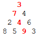
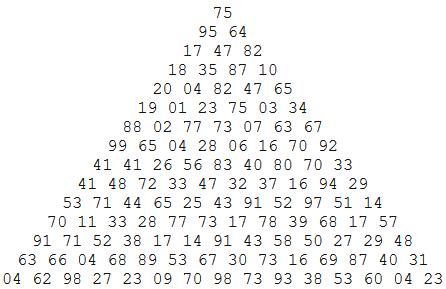

# Project-Euler-18
Project Euler is a series of challenging mathematical/computer programming problems that will require more than just mathematical insights to solve.

By starting at the top of the triangle below and moving to adjacent numbers on the row below, the maximum total from top to bottom is 23.

  

That is, 3 + 7 + 4 + 9 = 23.

Find the maximum total from top to bottom of the triangle below:

  

(Credit: https://projecteuler.net/problem=18)

There is also another problem which is <a href="https://projecteuler.net/problem=67">here</a> with much more complicated triangle. Our algorithm is also able to solve the max sum in it. The special thing about this problem is if you try to solve it by using "Brute Force" method, it would take 20 billion years to solve it. But with our algorithm, it takes only seconds. 
